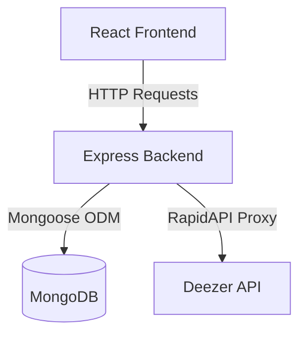

# 🎧 Soundify

Soundify is a modern, high-performance, dark-themed music streaming and search application modeled after modern web streaming players. Built using a decoupled client-server architecture, it features a React + Vite frontend and a Node.js + Express backend integrated with MongoDB and the external Deezer API.

---

## 🏗️ Architecture Overview

Soundify is structured as a monorepo containing two decoupled systems:
1. **Frontend (`/soundify`)**: A React application powered by Vite, offering an interface styled with premium dark mode aesthetics, dynamic hover transitions, custom media player elements, and state-driven authentication simulation.
2. **Backend (`/backend`)**: A lightweight REST API server built on Express, utilizing Mongoose to read/write custom tracks in MongoDB, and proxying client search requests directly to Deezer API endpoints via RapidAPI.

---
