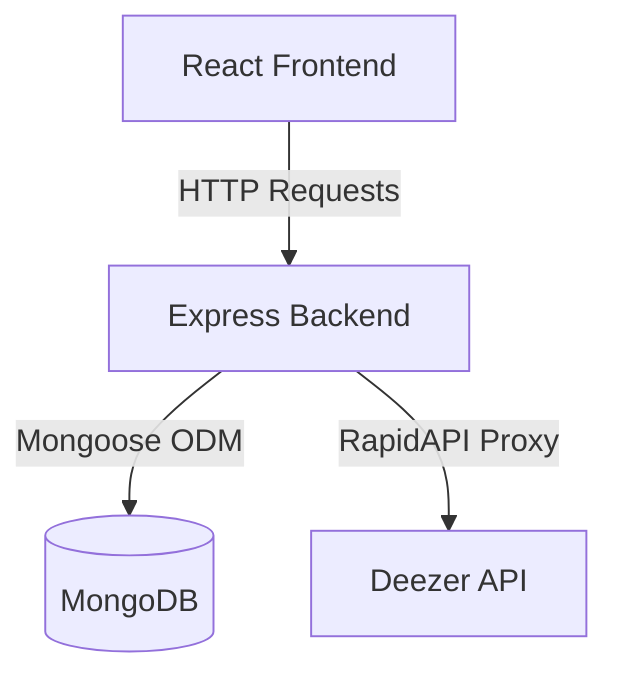

# 🎧 Soundify

Soundify is a modern, high-performance, dark-themed music streaming and search application modeled after modern web streaming players. Built using a decoupled client-server architecture, it features a React + Vite frontend and a Node.js + Express backend integrated with MongoDB and the external Deezer API.

---

## 🏗️ Architecture Overview

Soundify is structured as a monorepo containing two decoupled systems:
1. **Frontend (`/soundify`)**: A React application powered by Vite, offering an interface styled with premium dark mode aesthetics, dynamic hover transitions, custom media player elements, and state-driven authentication simulation.
2. **Backend (`/backend`)**: A lightweight REST API server built on Express, utilizing Mongoose to read/write custom tracks in MongoDB, and proxying client search requests directly to Deezer API endpoints via RapidAPI.



---
## ✨ Key Features

- **Dynamic Music Search**: Real-time searching across millions of tracks using the external Deezer API proxy, returning track meta, cover art, and 30-second preview audio.
- **Embedded Audio Player**: A custom-styled fixed media player utilizing HTML5 Audio APIs, supporting automatic playback on song selection and real-time controls.
- **Mock Authentication Flow**: An interactive login portal providing credentials verification and secure Guest Session bypass to mimic production OAuth behavior.
- **MongoDB Track Curations**: Database routes ready to manage, add, and fetch locally curated music collections.
- **Premium UX Design System**: Responsive grid structures, sleek glassmorphism panels, customized input fields, and smooth micro-animations.

---

## 🛠️ Technology Stack

### Frontend
- **Framework**: React 19 (Functional Components & Hooks)
- **Bundler**: Vite
- **Styling**: Vanilla CSS with modern dynamic inline styles
- **Icons**: Emoji & custom design shapes for high-performance rendering

### Backend
- **Platform**: Node.js & Express
- **Database**: MongoDB (via Mongoose)
- **Integrations**: RapidAPI (Deezer API Client)
- **Security & Config**: CORS, Dotenv

---
## 📁 Directory Structure

```text
Soundify/
├── backend/                  # REST API Server
│   ├── models/
│   │   └── Song.js           # Mongoose Song Schema
│   ├── routes/
│   │   ├── search.js         # Deezer API integration
│   │   └── songs.js          # DB Song operations
│   ├── .env                  # Environment keys
│   ├── index.js              # Express app initialization
│   └── package.json
│
└── soundify/                 # Single Page React App
    ├── public/               # Static assets
    ├── src/
    │   ├── components/
    │   │   ├── Login.jsx     # Login card with mock verification
    │   │   ├── Sidebar.jsx   # Fixed navigation panel
    │   │   ├── Main.jsx      # Content layout & search engine
    │   │   ├── SongCard.jsx  # Interactive music display item
    │   │   └── Player.jsx    # Sticky bottom audio controller
    │   ├── App.jsx           # Global state & view router
    │   ├── index.css         # Global design tokens
    │   └── main.jsx          # Entry point
    ├── vite.config.js
    └── package.json
```

---
## 🚀 Getting Started

### 📋 Prerequisites
Ensure you have the following installed:
- [Node.js](https://nodejs.org/) (v16.x or higher recommended)
- [MongoDB](https://www.mongodb.com/) (Local or MongoDB Atlas instance)

---

### 🔧 1. Backend Setup

1. Navigate to the backend directory:
   ```bash
   cd backend
   ```
2. Install the required Node dependencies:
   ```bash
   npm install
   ```
3. Create a `.env` file in the `backend/` root:
   ```env
   MONGO_URI=your_mongodb_connection_string
   RAPID_API_KEY=your_rapid_api_key
   ```
4. Start the development server:
   ```bash
   node index.js
   ```
   *The backend will boot up at `http://localhost:5000`.*

---
### 🎨 2. Frontend Setup

1. Navigate to the frontend directory:
   ```bash
   cd ../soundify
   ```
2. Install the client-side dependencies:
   ```bash
   npm install
   ```
3. Boot up the Vite local server:
   ```bash
   npm run dev
   ```
   *The client app will launch at `http://localhost:5173` (or similar active port).*

---
## 🔌 API Documentation

### 1. Health Status
- **Endpoint**: `GET /`
- **Response**: `200 OK` (Plain text confirmation)

### 2. Search Music (Deezer Proxy)
- **Endpoint**: `GET /search/:query`
- **Parameters**: `query` (URL-encoded search term)
- **Response**: JSON array containing search results:
  ```json
  [
    {
      "id": 1234567,
      "title": "Song Title",
      "artist": "Artist Name",
      "preview": "https://deezer.com/preview/link.mp3",
      "cover": "https://deezer.com/cover/medium.jpg"
    }
  ]
  ```

### 3. Retrieve Curated Songs
- **Endpoint**: `GET /songs`
- **Response**: JSON array of documents from MongoDB.

### 4. Create Curated Song
- **Endpoint**: `POST /songs`
- **Body**:
  ```json
  {
    "title": "New Song",
    "artist": "New Artist",
    "file": "path/to/audio/file.mp3"
  }
  ```
- **Response**: JSON of the saved Mongoose document.

---
## 🔗 Code Reference & Architecture Links

The codebase architecture relies on these core components:

- **Server Entry**: [backend/index.js](file:///e:/My Projects/Soundify/backend/index.js) — Express configurations and database connections.
- **Search Provider**: [backend/routes/search.js](file:///e:/My Projects/Soundify/backend/routes/search.js) — Interface layer calling RapidAPI.
- **Database Schema**: [backend/models/Song.js](file:///e:/My Projects/Soundify/backend/models/Song.js) — Document blueprint for Mongo collections.
- **Client App Core**: [soundify/src/App.jsx](file:///e:/My Projects/Soundify/soundify/src/App.jsx) — Logic orchestrator routing guests vs authenticated views.
- **Core Search Layout**: [soundify/src/components/Main.jsx](file:///e:/My Projects/Soundify/soundify/src/components/Main.jsx) — Performs search requests to local backend API.
- **Authentication**: [soundify/src/components/Login.jsx](file:///e:/My Projects/Soundify/soundify/src/components/Login.jsx) — Responsive credential fields with simulated auth.
- **Audio Interface**: [soundify/src/components/Player.jsx](file:///e:/My Projects/Soundify/soundify/src/components/Player.jsx) — Dynamic media player using audio previews.
- **Track Card UI**: [soundify/src/components/SongCard.jsx](file:///e:/My Projects/Soundify/soundify/src/components/SongCard.jsx) — Beautiful glassmorphic grid items with hover states.

---

## 📈 Future Enhancements

1. **True JWT Authentication**: Replace simulated authentication with JSON Web Tokens and MongoDB user accounts.
2. **Library Customization**: Allow users to save their favorite tracks returned from searches directly into custom play collections (interacting with `POST /songs`).
3. **Audio Player Customization**: Replace the default native audio tag controls with customized React components matching the green Spotify-inspired color palette.
