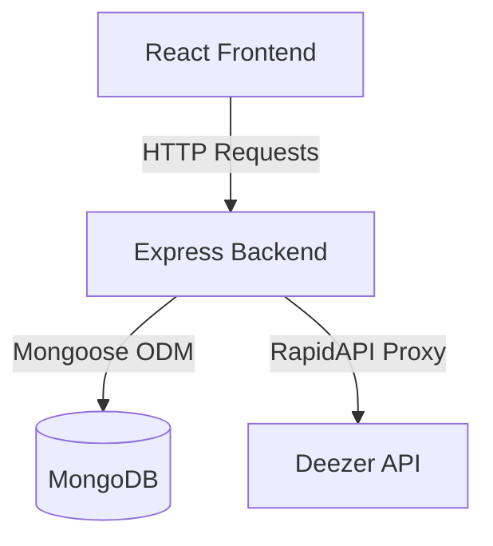

# 🎧 Soundify

Soundify is a modern, high-performance, dark-themed music streaming and search application modeled after modern web streaming players. Built using a decoupled client-server architecture, it features a React + Vite frontend and a Node.js + Express backend integrated with MongoDB and the external Deezer API.

---

## 🏗️ Architecture Overview

Soundify is structured as a monorepo containing two decoupled systems:
1. **Frontend (`/soundify`)**: A React application powered by Vite, offering an interface styled with premium dark mode aesthetics, dynamic hover transitions, custom media player elements, and state-driven authentication simulation.
2. **Backend (`/backend`)**: A lightweight REST API server built on Express, utilizing Mongoose to read/write custom tracks in MongoDB, and proxying client search requests directly to Deezer API endpoints via RapidAPI.


```mermaid
graph TD
    Client[React Frontend] -->|HTTP Requests| Server[Express Backend]
    Server -->|Mongoose ODM| DB[(MongoDB)]
    Server -->|RapidAPI Proxy| Deezer[Deezer API]
```

---

## ✨ Key Features

- **Custom Audio Player**: Sticky media player bar with interactive timeline scrubber, volume controls, queue popover, shuffle, and repeat.
- **Dynamic Music Search**: Instant live debounced search across millions of tracks with fallback dataset for uninterrupted playback.
- **User Playlists & Favorites**: Create and manage custom playlists and save liked songs to MongoDB.
- **JWT User Authentication**: Real signup/login with password hashing (`bcryptjs`), JWT token validation, and Guest session bypass.
- **MP3 File Upload Engine**: Host custom user MP3 audio uploads with disk storage via Express `multer` middleware.
- **Top Charts & Discovery**: Home dashboard featuring trending top charts, genre filters, and recently played songs.
- **Premium Spotify Aesthetics**: Sleek dark theme, glassmorphic card elements, toast alerts, and responsive navigation.

---

## 📁 Directory Structure

```text
Soundify/
├── backend/                  # REST API Server
│   ├── models/
│   │   ├── User.js           # User Auth & Liked Songs Schema
│   │   ├── Playlist.js       # User Playlist Schema
│   │   └── Song.js           # Track & File Schema
│   ├── routes/
│   │   ├── auth.js           # JWT Register/Login/Like Endpoints
│   │   ├── playlists.js      # Playlist CRUD operations
│   │   ├── search.js         # Search & Trending Deezer integration
│   │   └── songs.js          # Track retrieval & MP3 file uploads
│   ├── public/uploads/       # Uploaded MP3 audio files
│   ├── index.js              # Server initialization
│   └── package.json
│
└── soundify/                 # Single Page React App
    ├── src/
    │   ├── context/
    │   │   └── AudioContext.jsx # Global playback & session state
    │   ├── components/
    │   │   ├── Home.jsx      # Top Charts & Discovery Dashboard
    │   │   ├── Library.jsx   # Playlists & Liked Songs manager
    │   │   ├── Login.jsx     # JWT Authentication & Guest view
    │   │   ├── Main.jsx      # View Router & Debounced search engine
    │   │   ├── Player.jsx    # Custom Audio Player bar & Queue
    │   │   ├── Sidebar.jsx   # Fixed navigation panel & Profile badge
    │   │   ├── SongCard.jsx  # Glassmorphic track card with context menu
    │   │   ├── ToastNotification.jsx # Feedback alerts
    │   │   └── UploadModal.jsx # Custom MP3 file upload modal
    │   ├── App.jsx           # Application wrapper
    │   ├── index.css         # Styling system & dark mode tokens
    │   └── main.jsx          # Entry point
    └── package.json
```

---

## 🚀 Getting Started

### 📋 Prerequisites
Ensure you have the following installed:
- [Node.js](https://nodejs.org/) (v16.x or higher recommended)
- [MongoDB](https://www.mongodb.com/) (Local or MongoDB Atlas instance)

---

### 🔧 1. Backend Setup

1. Navigate to the backend directory:
   ```bash
   cd backend
   ```
2. Install the required Node dependencies:
   ```bash
   npm install
   ```
3. Create a `.env` file in the `backend/` root:
   ```env
   MONGO_URI=your_mongodb_connection_string
   RAPID_API_KEY=your_rapid_api_key
   ```
4. Start the development server:
   ```bash
   node index.js
   ```
   *The backend will boot up at `http://localhost:5000`.*

---

### 🎨 2. Frontend Setup

1. Navigate to the frontend directory:
   ```bash
   cd ../soundify
   ```
2. Install the client-side dependencies:
   ```bash
   npm install
   ```
3. Boot up the Vite local server:
   ```bash
   npm run dev
   ```
   *The client app will launch at `http://localhost:5173` (or similar active port).*

---

## 🔌 API Documentation

### 1. Health Status
- **Endpoint**: `GET /`
- **Response**: `200 OK` (Plain text confirmation)

### 2. User Authentication (JWT)
- **Register**: `POST /api/auth/register` (Body: `username`, `email`, `password`)
- **Login**: `POST /api/auth/login` (Body: `email`, `password`)
- **Get Profile**: `GET /api/auth/me` (Header: `Authorization: Bearer <token>`)
- **Toggle Liked Track**: `POST /api/auth/toggle-like` (Body: `{ song }`)

### 3. Custom Playlists API
- **Fetch User Playlists**: `GET /playlists`
- **Create Playlist**: `POST /playlists` (Body: `name`, `description`)
- **Add Song to Playlist**: `POST /playlists/:id/songs` (Body: `{ song }`)
- **Remove Song from Playlist**: `DELETE /playlists/:id/songs/:songId`
- **Delete Playlist**: `DELETE /playlists/:id`

### 4. Search & Trending Music
- **Search Music**: `GET /search/:query`
- **Get Top Charts**: `GET /search/trending`

### 5. Song Curations & File Uploads
- **Fetch Songs**: `GET /songs`
- **Upload Custom MP3**: `POST /songs/upload` (`multipart/form-data`: `audio`, `cover`, `title`, `artist`)

---

## 🔗 Code Reference & Architecture Links

The codebase architecture relies on these core components:

- **Server Initialization**: [backend/index.js](file:///e:/My Projects/Soundify/backend/index.js) — Express configurations, database connection & static uploads serving.
- **Authentication Provider**: [backend/routes/auth.js](file:///e:/My Projects/Soundify/backend/routes/auth.js) — JWT user registration, login & liked tracks handler.
- **Playlist Controller**: [backend/routes/playlists.js](file:///e:/My Projects/Soundify/backend/routes/playlists.js) — User playlist management endpoints.
- **Search Engine**: [backend/routes/search.js](file:///e:/My Projects/Soundify/backend/routes/search.js) — Deezer API proxy & trending top hits provider.
- **File Upload Handler**: [backend/routes/songs.js](file:///e:/My Projects/Soundify/backend/routes/songs.js) — Multer MP3 file upload engine.
- **Global Context**: [soundify/src/context/AudioContext.jsx](file:///e:/My Projects/Soundify/soundify/src/context/AudioContext.jsx) — Core player queue & auth state management.
- **Audio Interface**: [soundify/src/components/Player.jsx](file:///e:/My Projects/Soundify/soundify/src/components/Player.jsx) — Dynamic media player bar & queue popover.
- **Library Manager**: [soundify/src/components/Library.jsx](file:///e:/My Projects/Soundify/soundify/src/components/Library.jsx) — Playlists & Favorites dashboard.
